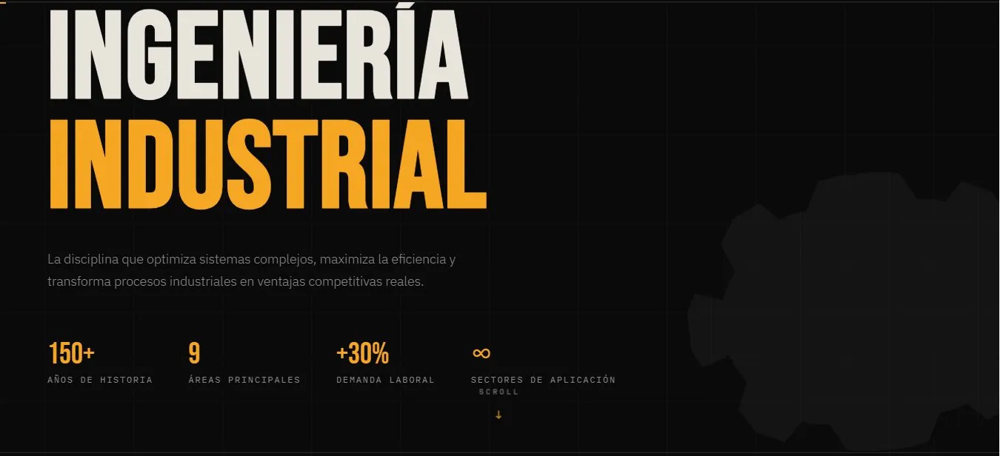
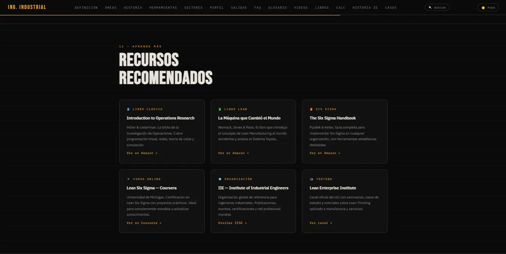
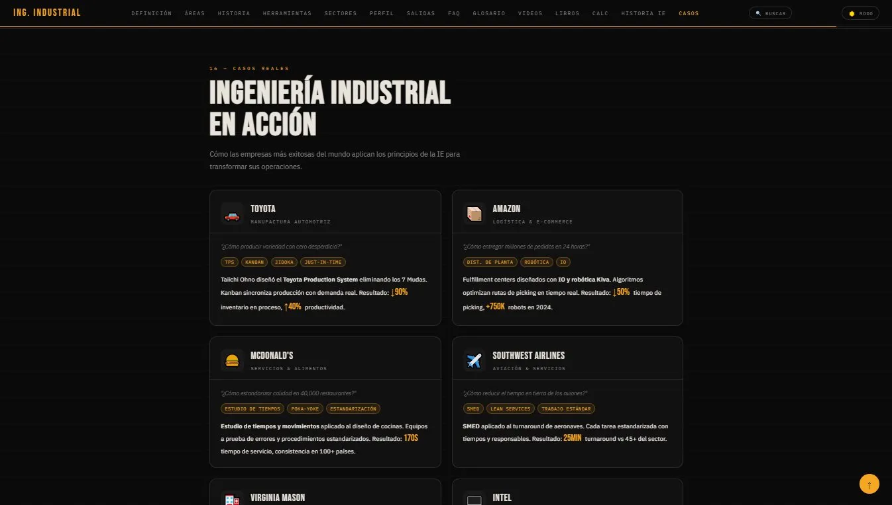
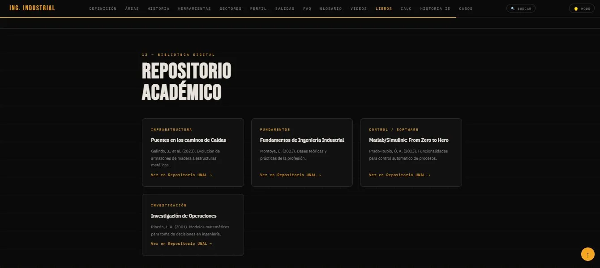

<div align="center">


**Guía visual e interactiva sobre Ingeniería Industrial** — una página web completa construida en HTML/CSS puro, sin frameworks ni dependencias.

[🌐 Ver sitio en vivo](#) · [📋 Reportar un error](../../issues) · [💡 Sugerir mejora](../../issues)

</div>

---

## 📌 Tabla de contenidos

- [Descripción](#-descripción)
- [Vista previa](#-vista-previa)
- [Secciones del sitio](#-secciones-del-sitio)
- [Tecnologías](#-tecnologías)
- [Cómo usar localmente](#-cómo-usar-localmente)
- [Estructura del proyecto](#-estructura-del-proyecto)
- [Contribuir](#-contribuir)
- [Licencia](#-licencia)

---

## 📖 Descripción

<div align="center">

Este repositorio contiene una **guía web completa sobre Ingeniería Industrial**, diseñada para estudiantes, profesionales y cualquier persona interesada en la disciplina. El sitio cubre desde los fundamentos históricos hasta herramientas modernas como Lean Manufacturing, Six Sigma y el Sistema Toyota.

El proyecto está construido en **HTML, CSS y JavaScript puro** — sin frameworks, sin dependencias, sin instalación. Solo abre el archivo y funciona.

</div>

---

## 🖥 Vista previa

<div align="center">

> El sitio está alojado en GitHub Pages. Incluye navegación fija, modo scroll con barra de progreso, menú móvil responsive, acordeón FAQ, buscador de glosario y videoteca interactiva.

<br>



<br>



<br>



<br>



<!-- DEBUG: prueba directa -->


</div>

---

## 📚 Secciones del sitio

<div align="center">

| # | Sección | Contenido |
|---|---------|-----------|
| 01 | **Fundamentos** | Definición, objetivos y enfoque sistémico de la IE |
| 02 | **Áreas de conocimiento** | Las 9 especialidades principales |
| 03 | **Historia y origen** | Evolución desde la Revolución Industrial hasta hoy |
| 04 | **Herramientas y métodos** | Lean, Six Sigma, Kaizen, VSM, SMED y más |
| 05 | **Sectores de aplicación** | Manufactura, salud, logística, tecnología, etc. |
| 06 | **IE vs otras ingenierías** | Tabla comparativa con otras ramas |
| 07 | **Perfil del ingeniero** | Competencias y habilidades clave |
| 08 | **Salidas laborales** | Roles y oportunidades profesionales |
| 09 | **FAQ** | Preguntas frecuentes con acordeón interactivo |
| 10 | **Glosario industrial** | Términos clave con buscador en tiempo real |
| 11 | **Recursos recomendados** | Libros, cursos y organizaciones de referencia |
| 12 | **Videoteca industrial** | Videos seleccionados sobre producción y logística |
| 13 | **Repositorio académico** | Publicaciones de la UNAL disponibles online |

</div>

---

## 🛠 Tecnologías

<div align="center">

- **HTML5** — estructura semántica
- **CSS3** — diseño responsivo con variables CSS, grid y flexbox
- **JavaScript vanilla** — interactividad sin librerías
- **Google Fonts** — Bebas Neue + IBM Plex Sans + IBM Plex Mono
- **YouTube embed API** — videoteca con carga lazy (thumbnail → player)
- **GitHub Pages** — despliegue gratuito

</div>

---

## 💻 Cómo usar localmente

<div align="center">

No requiere instalación. Solo clona el repositorio y abre el archivo:

</div>

```bash
git clone https://github.com/TU_USUARIO/TU_REPOSITORIO.git
cd TU_REPOSITORIO
```

<div align="center">

Luego abre `index.html` en tu navegador. También puedes usar la extensión **Live Server** de VS Code para recarga automática.

</div>

---

## 📁 Estructura del proyecto

```
📦 ingenieria-industrial/
├── 📄 index.html
├── 📄 README.md
├── 📄 LICENSE
├── 🖼 hero.png
├── 🖼 recursos.png
├── 🖼 casos.png
└── 🖼 repositorio.png
```

<div align="center">

> El proyecto es intencionalmente un archivo único (`index.html`) para máxima portabilidad y simplicidad de despliegue.

</div>

---

## 🤝 Contribuir

<div align="center">

¿Encontraste un error o tienes una idea para mejorar el sitio? Las contribuciones son bienvenidas.

</div>

1. Haz un **fork** del repositorio
2. Crea una rama: `git checkout -b mejora/descripcion-corta`
3. Realiza tus cambios en `index.html`
4. Haz commit: `git commit -m "feat: descripción del cambio"`
5. Abre un **Pull Request** con una descripción clara de lo que cambiaste

<div align="center">

Para reportar errores o sugerir nuevas secciones, abre un [Issue](../../issues).

</div>

---

## 📄 Licencia

<div align="center">

Este proyecto está bajo la licencia **MIT** — puedes usarlo, modificarlo y distribuirlo libremente con atribución.

---

<sub>Hecho con ⚙️ · Ingeniería Industrial Guide · 2024</sub>

</div>
